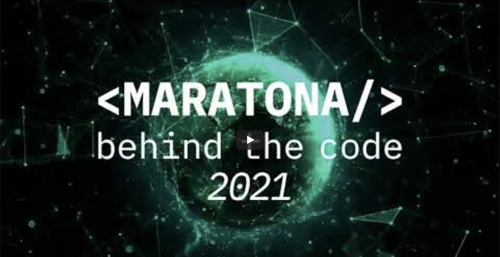

[](https://cloud.ibm.com)
[](https://discord.gg/yJYmTGDWKH)

# Desafio 03 | GFT

- [1. Sobre a GFT](#1-sobre-a-gft)
  - [1.1. Introdução](#11-introdução)
  - [1.2. Premiação](#12-premiação)
- [2. Desafio de negócio](#2-desafio-de-negócio)
- [3. Objetivo](#3-objetivo)
- [4. Tecnologias aplicadas](#4-tecnologias-aplicadas)
- [5. Desenvolvimento da solução](#5-desenvolvimento-da-solução)
  - [5.1. Pré-requisitos](#51-pré-requisitos)
  - [5.2. Resumo das tarefas](#52-resumo-das-tarefas)
  - [5.3. Desenvolvimento](#53-desenvolvimento)
- [6. Submissão](#6-submissão)
- [7. Sobre a avaliação](#7-sobre-a-avaliação)

## Para te ajudar

- [Material de Apoio](#material-de-apoio)

## 1. Sobre a GFT

### 1.1. Introdução

A GFT é uma empresa especializada em serviços de tecnologia para o segmento financeiro, com foco em apoiar as jornadas de transformação digital dos clientes, entregando inovação, qualidade, tecnologia de ponta com agilidade e escala.

Possui vasta experiência atendendo o setor financeiro, desde banco de varejo a mercados de capitais. Além disso, também está impulsionando a transformação digital dos setores de seguros e indústria.

A GFT tem 34 anos de inovação, desde 1987 moldando o progresso tecnológico no mundo. Está presente em 15 países, com mais de 7000 colaboradores no mundo, e só no Brasil tem mais de 2500 pessoas. A GFT acredita em um mundo digital, e que para um crescimento exponencial é preciso ser inovador na área de TI.

Com a GFT, a tecnologia oferece um claro valor de negócios, capacitando os clientes a serem líderes nos seus mercados.

<div align="center">
    <a href="https://youtu.be/zxKtukevSHk">
        
    </a>
</div>

### 1.2. Premiação

A GFT vai premiar as 3 (três) melhores pessoas colocadas em seu desafio através de vale-compras (em dólar) na seguinte ordem:

- Top 1 - US$ 850
- Top 2 - US$ 460
- Top 3 - US$ 350.

## 2. Desafio de negócio

O desafio GFT de Open Finance permitirá aos participantes deparar-se com a nova realidade de compartilhamento de informações, confrontando bases de três instituições diferentes, dois bancos e uma seguradora e a partir destes dados, desenvolver uma visão holística aprimorada do cliente e via Ciência de dados, realizar a modelagem da melhor oferta e cesta de produtos para estes clientes. Serão praticadas habilidades de engenharia de dados e ciência de dados!

O Open Finance é a evolução do Open Banking, é o sistema financeiro aberto que vai trazer mais transparência e autonomia para os usuários. Com ele, será possível que um indivíduo decida quais instituições terão acesso às suas informações, para quais finalidades e período específicos. Conforme a evolução da implementação do Open Finance, haverá a possibilidade de compartilhamento de dados sobre seguros, investimentos, fundos de pensão e previdência. A implementação do Open Finance no Brasil foi dividida em quatro fases. São elas:

1.  Abertura de dados das instituições

A primeira fase, que teve início em fevereiro/21, foi quando as instituições financeiras disponibilizaram ao público informações básicas, como canais de atendimento e serviços oferecidos.

2.  Compartilhamento de dados dos clientes

Clientes passam a ter papel ativo no compartilhamento de suas informações, podendo, se assim desejarem, dividir dados que fazem a diferença para uma oferta de produtos melhores (dados cadastrais, de transações de conta, de cartão e os dados das operações de crédito). Etapa foi implementada no último dia 13 de agosto.

3. Iniciação de pagamento e encaminhamento de proposta de operação de crédito

Nessa fase, começa a integração de serviços com as transações de pagamento e encaminhamento de propostas de operações de crédito acontecendo em um ambiente unificado.

4. Outros dados de produtos e serviços

A ser implementada a partir do dia 15 de dezembro, esta fase será responsável pela inclusão de serviços mais complexos (como investimentos, previdência, seguros e câmbio) no sistema.

Em uma visão de open Finance o Banco de Varejo (RetailBankEFG) tem acesso via open finance, com o devido consentimento dos clientes, as informações da instituição financeira (InvestmentBankCDE) um banco de investimentos e as informações destes clientes referente a outra instituição financeira uma seguradora (InsuranceCompanyABC).

## 3. Objetivo

O desafio consiste de agregar as bases destas instituições proporcionadas pelo novo ambiente do Open Finance, realizar o tratamento dos dados e desenvolver modelos de recomendação de produtos a partir do uso de algoritmos como os de [Regras de Associação](https://en.wikipedia.org/wiki/Association_rule_learning#Algorithms), considerando uma confiança na regra de 80% e um suporte mínimo de 10% com no máximo 5 antecedentes.

Os indivíduos da base serão escorados por este modelo e o arquivo resposta com as recomendações deve ser submetido para análise com a qual será averiguado o percentual de acerto de cada recomendação.

Vale lembrar que muitos indivíduos ficarão sem recomendação.

## 4. Tecnologias aplicadas

Para este desafio serão utilizados os seguintes serviços da IBM Cloud:

- [Watson Studio](https://cloud.ibm.com/catalog/services/watson-studio), também conhecido como Cloud Pak for Data as a Service. Esse serviço permite o uso de uma gama de ferramentas relacionadas à Ciência de Dados, inclusive execução de Jupyter Notebooks com processadores na nuvem.

## 5. Desenvolvimento da solução

### 5.1. Pré-requisitos

Para realizar esse desafio você deverá cumprir os seguintes pré-requisitos:

- [Registrar-se na Maratona Behind the Code](https://maratona.dev/?register=true) e confirmar seu e-mail de cadastro;
- Possuir uma [conta na IBM Cloud](https://ibm.biz/Bdf8dW), podendo ser a conta Lite ou Pay-As-You-Go (não é necessário registrar-se no evento com o mesmo e-mail utilizado para criar sua conta na IBM Cloud).

### 5.2. Resumo das Tarefas

1. Instanciar os serviços do desafio na IBM Cloud: Object Storage e Watson Studio (opcionais);
2. Explorar e tratar as bases de dados disponíveis;
3. Criar regras de associação baseadas nos dados propostos;
4. Criar recomendações de produtos para os clientes, baseadas nas regras de associação criadas;
5. Alterar o [arquivo de respostas](../../assets/data/ANSWERS.csv), adicionando as recomendações criadasm juntamente com seus níveis de confiança;
6. Efetuar a submissão na [página do desafio](https://maratona.dev/challenge/3).

### 5.3. Desenvolvimento

Os conjuntos de dados [InvestmentBankCDE](../../assets/data/InvestmentBankCDE.csv) e [RetailBankEFG](../../assets/data/RetailBankEFG.csv) contém dados de compras passadas dos clientes, assim como o conjunto [InsuranceCompanyABC](../../assets/data/InsuranceCompanyABC.csv), que inclui também alguns dados demográficos de seus clientes.

O desafio consiste no uso de um algoritmo de Machine Learning de aprendizagem não-supervisionada, como os de [Regra de Associação](https://en.wikipedia.org/wiki/Association_rule_learning#Algorithms), para criar recomendações de produtos aos clientes da base de dados. Os dados dos clientes coletados das três instituições devem ser usados, e até três recomendações de produtos podem ser feitas. Para as recomendações, deve-se considerar uma **confiança de regra de 80%** e um **suporte mínimo de 10%**, com um máximo de 5 antecedentes.

A sua tarefa é analisar os dados, e criar um modelo para recomendações a partir desses dados. As recomendações (até 3 por cliente) devem ser salvas no arquivo [ANSWERS.csv](../../assets/data/ANSWERS.csv). Lembre-se de que nem todo cliente precisa de uma recomendação necessariamente.

Os nomes de produtos nas recomendações devem aparecer da exata forma como estão nas colunas dos conjuntos de dados, sendo os seguintes:

```python
[
  "seguro auto",
  "seguro vida Emp",
  "seguro vida PF",
  "Seguro Residencial",
  "Investimento Fundos_cambiais",
  "Investimento Fundos_commodities",
  "Investimento LCI",
  "Investimento LCA",
  "Investimento Poupanca",
  "Investimento Fundos Multimercado",
  "Investimento Tesouro Direto",
  "Financiamento Casa",
  "Financiamento Carro",
  "Emprestimo _pessoal",
  "Emprestimo _consignado",
  "Emprestimo _limite_especial",
  "Emprestimo _educacao",
  "Emprestimo _viagem",
  "Investimento CDB",
  "Investimento Fundos"
]
```

**Atenção**: os dados disponibilizados neste desafio são fictícios, qualquer correlação com a realidade é mera coincidência.

## 6. Submissão

Com as recomendações prontas, o último passo é realizar a submissão. Será aceita somente uma submissão para o desafio, então teste bem antes de fazer o envio.

Para entregar o desafio, você deverá alterar o [arquivo com a tabela-resposta](../../assets/data/ANSWERS.csv) disponível nesse repositório, preenchendo o valor das colunas de recomendação e confiança, somente quando ocorrer uma recomendação Iremos avaliar sua solução nos baseando nas respostas do arquivo CSV.

Para realizar a submissão, você deverá acessar a página do desafio: [https://maratona.dev/challenge/3](https://maratona.dev/challenge/3) e enviar o arquivo CSV com as respostas, juntamente com um arquivo `.zip`, de até 10MB, contendo o código fonte da solução (lembre-se de remover dependências e datasets para não ocupar espaço). A página fará um teste para verificar se o arquivo CSV está no formato correto.

Você poderá acompanhar o status da submissão acessando a [página do desafio](https://maratona.dev/challenge/3), logando na sua conta.

## 7. Sobre a avaliação

Uma semana após o início do desafio, nosso sistema de avaliação automática começará as avaliações. Ele irá utilizar os dados enviados para calcular uma pontuação numérica de 1 até 100, com base no nível de assertividade das recomendações, juntamente com o nível de confiança nas mesmas. O arquivo `.zip` enviado deve conter todo o código utilizado para obter a solução. Caso contrário, a pontuação será zerada.

Caso o desafio seja entregue dentro do prazo de envio (até 05 de dezembro), o participante receberá uma bonificação de 10% da pontuação total (10 pontos), independendo do resultado de seu desafio. A pontuação máxima possível, portanto, é 110 (100 de avaliação + 10 de bônus).

Após o prazo de envio, o participante ainda poderá realizar sua submissão até dia 12 de dezembro, mas sem receber o bônus.

**Atenção**: o tempo de entrega é um critério de desempate, no caso de soluções com a mesma nota. Nos reservamos o direito de zerar a pontuação de uma submissão caso:

- O código fonte enviado não seja coerente com os resultados obtidos dos testes no modelo.
- Seja detectado plágio, de um ou mais participantes. Nesse caso, todos os participantes com a solução igual terão sua pontuação no desafio zerada.

## Material de apoio

- [Assuma o controle dos seus dados com o Watson Studio](https://developer.ibm.com/br/articles/overview-e-summary-ibm-watson-studio/)
- [Introdução ao IBM Watson Studio](https://developer.ibm.com/br/articles/introduction-to-ibm-watson-studio/)
- [Introdução ao IBM Cloud Pak for Data](https://developer.ibm.com/br/articles/get-started-with-ibm-cloud-pak-for-data/)
- [Desenvolva modelos de aprendizado de máquina com e sem AutoML](https://developer.ibm.com/br/articles/compare-model-building-with-and-without-automated-machine-learning/)
- [Desenvolva um modelo preditivo de aprendizado de máquina de forma rápida e fácil com o IBM SPSS Modeler](https://developer.ibm.com/br/tutorials/desenvolva-um-modelo-preditivo-de-aprendizado-de-mquina-de-forma-rpida-e-fcil-com-o-ibm-spss-modeler/)
- [Visualizar dados com Python](https://developer.ibm.com/br/patterns/visualize-data-with-python/)

Você também pode acessar o Discord oficial da Maratona 2021 para realizar perguntas e/ou interagir com outros participantes: [Discord](https://discord.gg/yJYmTGDWKH).

## License

Copyright 2021 Maratona Behind the Code

Licensed under the Apache License, Version 2.0 (the "License");
you may not use this file except in compliance with the License.
You may obtain a copy of the License at

       http://www.apache.org/licenses/LICENSE-2.0

Unless required by applicable law or agreed to in writing, software
distributed under the License is distributed on an "AS IS" BASIS,
WITHOUT WARRANTIES OR CONDITIONS OF ANY KIND, either express or implied.
See the License for the specific language governing permissions and
limitations under the License.
