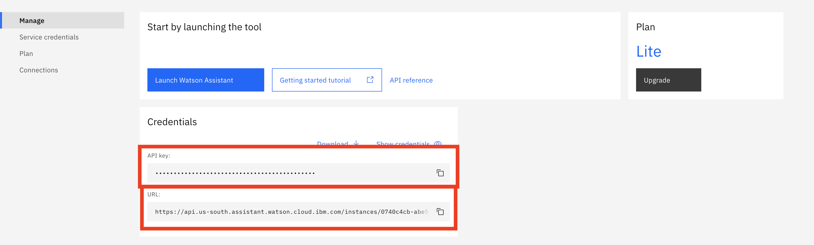
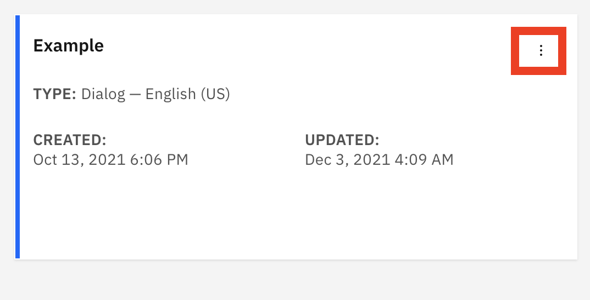
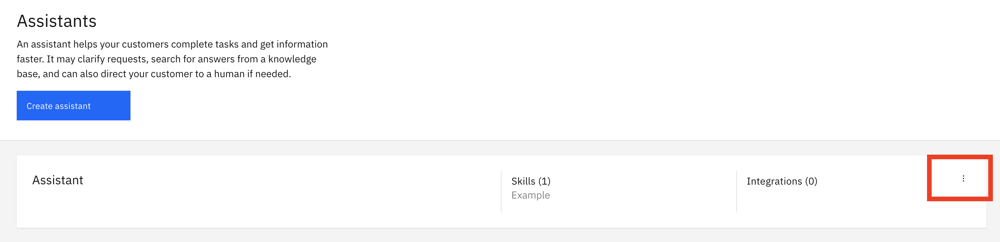

[](https://cloud.ibm.com)
[](https://discord.gg/yJYmTGDWKH)

# Desafío 04 | Algar Tech

- [1. Sobre Algar Tech](#1-sobre-algar-tech)
  - [1.1. Introducción](#11-introducción)
  - [1.2. Premiación](#12-premiación)
- [2. Desafío de negocio](#2-desafío-de-negocio)
- [3. Objetivo](#3-objetivo)
- [4. Tecnologias aplicadas](#4-tecnologias-aplicadas)
- [5. Desarrollo de la Solución](#5-desarrollo-de-la-solución)
- [5.1. Pre-requisitos](#51-pre-requisitos)
- [5.2. Resumen de Tareas](#52-resumen-de-tareas)
- [5.3. Desarollo](#53-desarollo)
- [6. Envío](#6-envío)
- [7. Sobre la evaluación](#7-sobre-la-evaluación)

## Para ayudarte

- [Material de Apoyo](#materiales-de-apoyo)

## 1. Sobre Algar Tech

### 1.1. Introducción

Desde hace 21 años repensamos la experiencia de sus clientes y la gestión del entorno tecnológico con un único propósito: conectar personas y organizaciones de forma única para ser el mejor socio para sus mejores resultados.

Operamos en toda Latinoamérica y nuestro mayor diferencial es: ¡nuestra Gente! Aquí todos se sienten como en casa. Nuestro entorno es COOL, la diversidad es nuestra especialidad y nuestro conocimiento es nuestra fuerza.

Nuestra misión es conectar personas y organizaciones de una manera única. Estamos hechos para quienes buscan resultados, por eso apostamos por transformar la relación entre clientes y empresas a través de soluciones inteligentes.

### 1.2. Premiación

Las top 5 personas mejor puntuadas en el desafío recibirán un voucher de US$ 520 cada una.

## 2. Desafío de negocio

Estamos en la cúspide de una revolución tecnológica que está cambiando la forma en que las empresas hacen negocios. Y el proceso de relación con el cliente no es diferente. La distancia social que impuso la pandemia aceleró la implementación de tecnologías, como la inteligencia artificial (IA), en la atención al cliente en los más diferentes canales digitales.

En este sentido, los chatbots son fundamentales para optimizar el servicio, brindando respuestas rápidas, estandarizadas, correctas, seguras y asegurando una sensación de conexión con el cliente durante el servicio. Nuestro desafío es integrar chatbots y servicio humano en una interacción de chat con un cliente, que será manejado por un servicio automatizado y transferido a un asesor cuando se requiera interacción humana.

## 3. Objetivo

El objetivo será crear un asistente virtual que será utilizado por una empresa de informática, Fake IT Solutions, en una página web. El cliente final debe poder realizar consultas y ser dirigido a la asistencia humana cuando sea necesario. 

Durante el chat, el asistente debe responder información sobre los servicios de la empresa, ayudar al cliente a resolver algunos tipos de problemas y, al identificar que no fue posible resolver un problema, comunicar al usuario con un asistente humano.

## 4. Tecnologias aplicadas

Para este desafío se utilizarán los siguientes servicios disponibles en IBM Cloud:

- [Watson Assistant](https://cloud.ibm.com/catalog/services/watson-assistant), una plataforma para la creación de chatbots de manera fácil, a través de intenciones, entidades y flujo de diálogo, y varias posibilidades de integración.

## 5. Desarrollo de la Solución

### 5.1. Pre-requisitos

Para realizar este desafío, debes cumplir con los siguientes requisitos previos:

- Registrarte en la [Maratón Behind the Code](https://maratona.dev/?register=true) y confirmar tu correo electrónico;
- Tener una [cuenta de IBM Cloud](https://ibm.biz/Bdf8dW), que puede ser Lite o Pay-As-You-Go (no es necesario registrarse para el evento con la misma dirección de correo electrónico utilizada para crear tu cuenta de IBM Cloud).

### 5.2. Resumen de Tareas

1. Crear una instancia de los servicios de desafío en IBM Cloud: [Watson Assistant](https://cloud.ibm.com/catalog/services/watson-assistant) (obligatorio);
2. Crear una `skill`, de tipo `dialog`, en la instancia de Watson Assistant;
3. Crear `intents` y `entities` neecesarias para el diálogo;
4. Implementar el flujo de diálogo propuesto, basado en las intenciones y entidades creadas;
5. Probar y validar la solución, repitiendo los pasos 2 a 4 según sea necesario;
6. Entregar la solución en la [página del desafío](https://maratona.dev/challenge/4).

### 5.3. Desarollo

El desafío es implementar un asistente virtual basado en Watson Assistant. Para aprender a usar esta herramienta puedes ver el siguiente video:

- [Tutorial Watson Assistant](https://www.youtube.com/watch?v=LqnCPZ9KEdg)

Crea una `skill` para su asistente, del tipo `Dialog skill`, en **español**. Dentro de la skill, debes implementar las funciones del asistente.

El flujo de conversación esperado es el siguiente:

```text
1. Al iniciar una conversación, el asistente siempre debe presentarse y preguntar al cliente cómo quiere que lo llamen. No es necesario realizar ninguna validación en la respuesta.

2. Después de capturar el nombre, el asistente debe preguntar por la ciudad del cliente. No es necesario realizar ninguna validación en el nombre de la ciudad.

3. Después de capturar la ciudad, el asistente debería preguntar cómo puede ayudar.

3.1. Si el cliente dice que tiene un problema, el asistente debe preguntar qué problema tiene el cliente y pasar a las condiciones 3.2. y 3.3.

3.2. Si el cliente dice que tiene un problema al usar una impresora local, el asistente debe preguntar cuál es el modelo de impresora y responder de acuerdo con el modelo. Si es un modelo conocido, el asistente debe enviar el enlace del driver de la impresora, en caso contrario, el flujo debe ir a la condición 3.3, teniendo el modelo de la impresora como descripción del problema. Las referencias del modelo y los enlaces de drivers esperados se encuentran en la Tabla 1, a continuación.

3.3. Si el cliente dice que tiene algún otro problema, el asistente debe guardar esta descripción del problema y preguntar si puede transferir al cliente a un operador humano y, de ser así, pasar a la condición 3.3.1. De lo contrario, el asistente debería preguntar si puede ayudar con algo más y volver al flujo inicial.

3.3.1. Si el cliente quiere ser transferido a un asistente humano, el asistente debe realizar una llamada a una API a través de Webhook, enviando como parámetro el nombre del cliente, la ciudad y la descripción del problema. El Webhook responderá si hay un asistente humano disponible o no. Los detalles para comunicarse con esta API se encuentran en la siguiente sección.

3.3.1.1. Si hay un asistente humano disponible, el asistente debe decir que transferirá y finalizar la conversación.

3.3.1.2. Si no hay un asistente humano disponible, el asistente debería indicarle que vuelva a intentarlo pronto y finalizar la conversación.

4. Cuando se le pregunte sobre la empresa, o sobre los servicios que ofrece, el asistente debe hablar un poco sobre la empresa de informática y decir que por el momento sólo ofrecen ayuda para problemas con impresoras. Esta respuesta debe contener necesariamente el nombre "Fake IT Solutions" y "problemas con impresoras".
```

| Modelo | Driver                                                                                                           |
| ------ | ---------------------------------------------------------------------------------------------------------------- |
| A1201  | https://fake.drivers.example.com/printer/A1201                                                                   |
| A1202  | https://fake.drivers.example.com/printer/A1202                                                                   |
| A1203  | https://fake.drivers.example.com/printer/A1203                                                                   |
| B904   | https://fake.drivers.example.com/printer/B904                                                                    |
| B905   | https://fake.drivers.example.com/printer/B905                                                                    |
| Otro   | Desconocido. Vaya al paso 3.3. del flujo de la conversación, utilizando el modelo como descripción del problema. |

Tabla 1. Modelos de impresora y respuestas esperadas

**Atención**: El Asistente debe interactuar con el cliente solo usando texto, no usando Options, imágenes o cualquier otro tipo de respuesta.

#### Sobre el Webhook

Para verificar si hay un asistente humano disponible, se debe realizar una llamada API a la siguiente dirección: https://help.maratona.dev. Esta llamada debe ser de tipo POST y debe contener un JSON con los siguientes parámetros:

```json
{
  "name": "Nombre del cliente",
  "city": "Ciudad del cliente",
  "problem": "Descripción del problema"
}
```

La API responderá con el siguiente JSON, que puede tener el valor `true` o `false`:

```json
{
  "available": true
}
```

Esta llamada a la API se puede realizar a través de un Webhook en Watson Assistant. Para obtener más detalles sobre cómo hacer esto puedes ver este [video sobre Webhooks](https://www.youtube.com/watch?v=j8TBqD2rx2o).

## 6. Envío

Con la skill lista, debes ir al menú de Watson Assistant y crear un asistente, asociándole esta skill. El último paso es realizar el envío. 

**Sólo se aceptará un envío para el desafío, así que pruébalo bien antes de enviarlo.**

Para resolver el desafío necesitarás cuatro valores, a saber:

1. `API key` y `URL` del Watson Assistant, que puedes encontrar en la página de inicio de Watson Assistant, dentro de IBM Cloud, como se muestra en la siguiente imagen:



2. `Skill ID`, que se encuentra en los detalles de la habilidad, haciendo clic en el icono, como se muestra en la imagen siguiente:



- `Assistant ID`, presente en los detalles del asistente haciendo clic en el icono como se muestra en esta imagen:



Para enviar la solución debes acceder a la página de desafío: [https://maratona.dev/challenge/4](https://maratona.dev/challenge/4) y enviar las credenciales solicitadas.

Podrás realizar un seguimiento del estado de la entrega accediendo a la [página del desafío](https://maratona.dev/challenge/4), iniciando sesión en tu cuenta.

## 7. Sobre la evaluación

Una semana después del inicio del desafío, nuestro sistema de evaluación automatizado iniciará las evaluaciones. Utilizará los datos para calcular una puntuación numérica del 1 al 100, basada en el nível de asertividad de las respuestas del asistente, de acuerdo con el flujo de conversación esperado. **Recuerda dejar tu servicio disponible hasta que la solución sea evaluada**.

El desafío debe ser entregado hasta el 12 de diciembre, y el participante recibirá una bonificación del 10% de la puntuación total (10 puntos), independientemente del resultado de su desafío. Por tanto, la puntuación máxima posible es 110 (puntuación de 100 + bonificación de 10).

**Atención**: el tiempo de entrega es un criterio de desempate, en caso de dos soluciones con la misma puntuación. Nos reservamos el derecho de darle a um envío cero de puntuación si:

- Se detecta plagio, de uno o más participantes. En este caso, se dará cero puntos al desafio entregado por todos los participantes con la misma solución.

## Materiales de apoyo

- [Documentación de Watson Assistant](https://cloud.ibm.com/docs/assistant?topic=assistant-getting-started&locale=es)
- [Actualiza tu chatbot en WhatsApp con IBM Watson Assistant](https://developer.ibm.com/es/tutorials/integrating-ibm-watson-assistant-with-whatsapp/)
- [Crea un asistente de voz con Watson Assistant](https://developer.ibm.com/es/tutorials/crea-un-asistente-de-voz-para-una-pizzeria-con-watson-assistant/)
- [Cómo crear un chatbot utilizando Watson Assistant y Discovery.](https://developer.ibm.com/es/patterns/como-crear-un-chatbot-utilizando-watson-assistant-y-discovery/)

Recuerda que puedes acceder al Discord oficial del Maratón 2021 para hacer preguntas y/o interactuar con otros participantes: [Discord](https://discord.gg/yJYmTGDWKH).

## License

Copyright 2021 Maratona Behind the Code

Licensed under the Apache License, Version 2.0 (the "License");
you may not use this file except in compliance with the License.
You may obtain a copy of the License at

       http://www.apache.org/licenses/LICENSE-2.0

Unless required by applicable law or agreed to in writing, software
distributed under the License is distributed on an "AS IS" BASIS,
WITHOUT WARRANTIES OR CONDITIONS OF ANY KIND, either express or implied.
See the License for the specific language governing permissions and
limitations under the License.
