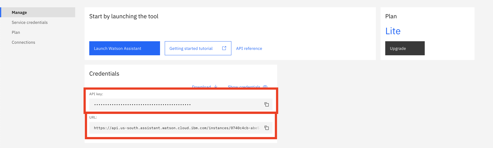
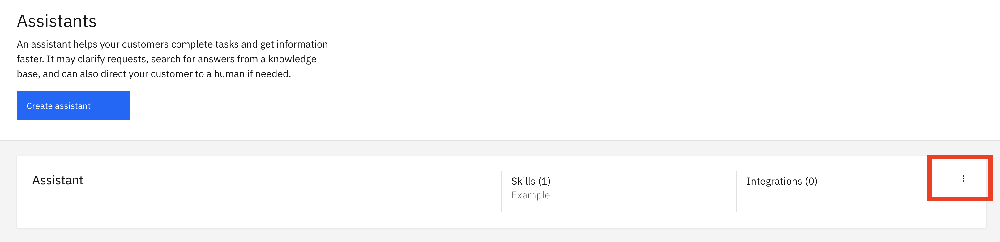

[](https://cloud.ibm.com)
[](https://discord.gg/yJYmTGDWKH)

# Desafio 04 | Algar Tech

- [1. Sobre a Algar Tech](#1-sobre-a-algar-tech)
  - [1.1. Introdução](#11-introdução)
  - [1.2. Premiação](#12-premiação)
- [2. Desafio de negócio](#2-desafio-de-negócio)
- [3. Objetivo](#3-objetivo)
- [4. Tecnologias aplicadas](#4-tecnologias-aplicadas)
- [5. Desenvolvimento da solução](#5-desenvolvimento-da-solução)
  - [5.1. Pré-requisitos](#51-pré-requisitos)
  - [5.2. Resumo das tarefas](#52-resumo-das-tarefas)
  - [5.3. Desenvolvimento](#53-desenvolvimento)
- [6. Submissão](#6-submissão)
- [7. Sobre a avaliação](#7-sobre-a-avaliação)

## Para te ajudar

- [Material de Apoio](#material-de-apoio)

## 1. Sobre a Algar Tech

### 1.1. Introdução

Há 21 anos repensamos a experiência dos seus clientes e a gestão do ambiente de tecnologia, com um único propósito: conectar pessoas e organizações de um jeito único para ser o melhor parceiro para os seus melhores resultados.

Atuamos em toda a América Latina, e o nosso maior diferencial é a Nossa Gente! Aqui todo mundo se sente em casa. Nosso ambiente é COOL, nossa diversidade é o nosso tempero e o nosso conhecimento é a nossa força.

Nossa missão é conectar pessoas e organizações de um jeito único. Somos feitos para quem busca resultados, e por isso nos comprometemos a transformar o relacionamento entre clientes e empresas por meio de soluções inteligentes.

### 1.2. Premiação

As top 5 melhores pessoas colocadas vão receber um voucher de US$ 520 cada.

## 2. Desafio de negócio

Estamos a bordo de uma revolução tecnológica que vem modificando a maneira como as empresas conduzem os negócios. E o processo de relacionamento com o cliente não é diferente. O distanciamento social imposto pela pandemia acelerou a implantação de tecnologias, como a inteligência artificial (IA), no atendimento ao consumidor nos mais diferentes canais digitais.

Nesse sentido os chatbots fundamentais para otimizar o atendimento, fornecendo respostas rápidas, padronizadas, corretas, seguras e garantindo um sentimento de conexão com o cliente durante o atendimento. Nosso desafio é integrar os chatbots e o atendimento humano numa interação de chat com um cliente, que será atendido pelo atendimento automatizado e transferido para o assessor quando é necessária a interação humana.

## 3. Objetivo

Seu objetivo será criar um assistente virtual que será utilizado por uma empresa de informática, a Fake IT Solutions, em uma página web. O cliente final deve poder fazer consultas e ser direcionado a um atendimento humano, quando necessário. Durante o chat, o assistente deverá responder informações sobre os serviços da empresa, ajudar o cliente a solucionar alguns tipos de problemas, e, ao identificar que não foi possível solucionar um problema, transferir o chat para o atendente humano.

## 4. Tecnologias aplicadas

Para este desafio serão utilizados os seguintes serviços da IBM Cloud:

- [Watson Assistant](https://cloud.ibm.com/catalog/services/watson-assistant), uma plataforma para criação de chatbots de forma fácil, por meio de intenções, entidades e fluxo de diálogos, e diversas possibilidades de integrações.

## 5. Desenvolvimento da solução

### 5.1. Pré-requisitos

Para realizar esse desafio você deverá cumprir os seguintes pré-requisitos:

- [Registrar-se na Maratona Behind the Code](https://maratona.dev/?register=true) e confirmar seu e-mail de cadastro;
- Possuir uma [conta na IBM Cloud](https://ibm.biz/Bdf8dW), podendo ser a conta Lite ou Pay-As-You-Go (não é necessário registrar-se no evento com o mesmo e-mail utilizado para criar sua conta na IBM Cloud).

### 5.2. Resumo das Tarefas

1. Instanciar os serviços do desafio na IBM Cloud: [Watson Assistant](https://cloud.ibm.com/catalog/services/watson-assistant) (obrigatório);
2. Criar uma `skill`, do tipo `dialog`, na instância de Watson Assistant;
3. Criar as `intents` e `entities` necessárias para o diálogo;
4. Implementar o fluxo de diálogo proposto, com base nas intenções e entidades criadas;
5. Testar e validar a solução, repetindo os passos 2 a 4 enquanto necessário;
6. Efetuar a submissão na [página do desafio](https://maratona.dev/challenge/4).

### 5.3. Desenvolvimento

O desafio consiste na implementação de um assistente virtual baseado em Watson Assistant. Para aprender a utilizar essa ferramenta, assista aos seguintes vídeos:

- [1. Introdução](https://www.youtube.com/watch?v=n3vjUKmQ-Xc)
- [2. Entidades e slots](https://www.youtube.com/watch?v=RdMw6bt0_kU)
- [3. Webhook](https://www.youtube.com/watch?v=veAbfHWDB1k)

Crie uma `skill` para seu assistente, do tipo `Dialog skill`, na língua **português brasileiro**. Dentro da skill, você deverá implementar as funcionalidades do assistente.

O fluxo de conversação esperado é o seguinte:

```text
1. Ao iniciar uma conversa, o assistente deverá sempre se apresentar e perguntar ao cliente como deseja ser chamado. Nenhuma validação precisa ser feita na resposta.

2. Após a captura do nome, o assistente deve perguntar qual a cidade do cliente. Nenhuma validação precisa ser feita no nome da cidade.

3. Após a captura da cidade, o assistente deve perguntar como pode ajudar.

3.1. Caso o cliente diga que tem um problema, o assistente deverá perguntar qual problema o cliente está enfrentando, e seguir para as condições 3.2. e 3.3.

3.2. Caso o cliente diga que tem um problema para utilizar uma impressora local, o assistente deverá perguntar qual o modelo da impressora, e responder de acordo com o modelo. Caso seja um modelo conhecido, o assistente deve enviar o link de seu driver, caso contrário, o fluxo deve seguir para a condição 3.3, tendo como descrição do problema o modelo da impressora. As referências de modelo e links de drivers esperados estão na Tabela 1, abaixo.

3.3. Caso o cliente diga que tem algum outro problema, o assistente deverá salvar essa descrição do problema e perguntar se pode transferir o cliente para um atendente humano, e, se sim, seguir para a condição 3.3.1. Se não, o assistente deve perguntar se pode ajudar em algo mais e voltar para o fluxo inicial.

3.3.1. Caso o cliente queira ser transferido a um atendente humano, o assistente deverá realizar uma chamada para uma API via Webhook, enviando como parâmetro o nome do cliente, sua cidade, e a descrição de seu problema. O Webhook responderá se há um atendente humano disponível ou não. Os detalhes para a comunicação com essa API estão na próxima seção.

3.3.1.1. Caso um atendente humano esteja disponível, o assistente deve dizer que irá transferir e encerrar a conversação.

3.3.1.2. Caso um atendente humano não esteja disponível, o assistente deve dizer para tentar novamente em breve e encerrar a conversação.

4. Quando questionado sobre a empresa, ou sobre os serviços que oferece, o assistente deve discorrer um pouco sobre a empresa de informática, e dizer que no momento está oferecendo somente ajuda para problemas com impressoras. Essa resposta deve necessariamente conter o nome "Fake IT Solutions" e "problemas com impressoras".
```

| Modelo | Driver                                                                                              |
| ------ | --------------------------------------------------------------------------------------------------- |
| A1201  | https://fake.drivers.example.com/printer/A1201                                                      |
| A1202  | https://fake.drivers.example.com/printer/A1202                                                      |
| A1203  | https://fake.drivers.example.com/printer/A1203                                                      |
| B904   | https://fake.drivers.example.com/printer/B904                                                       |
| B905   | https://fake.drivers.example.com/printer/B905                                                       |
| Outro  | Desconhecido. Ir ao passo 3.3. do fluxo de conversação, usando o modelo como descrição do problema. |

Tabela 1. Modelos de impressoras e respostas esperadas

**Atenção**: O Assistente deve interagir com o cliente somente utilizando texto, não utilizando respostas do tipo Options, imagens ou qualqueer outro.

#### Sobre o Webhook

Para verificar se um atendente humano está disponível, uma chamada API deve ser feita para o seguinte endereço: https://help.maratona.dev. Essa chamada deve ser um POST, contendo um JSON com os seguintes parâmetros:

```json
{
  "name": "Nome do cliente",
  "city": "Cidade do cliente",
  "problem": "Descrição do problema"
}
```

A API responderá com o seguinte JSON, podendo ter o valor `true` ou `false`:

```json
{
  "available": true
}
```

Essa chamada de API poderá ser feita por meio de um Webhook no Watson Assistant. Para mais detalhes de como fazer isso, veja o [vídeo sobre Webhooks](https://www.youtube.com/watch?v=veAbfHWDB1k).

## 6. Submissão

Com a skill pronta, você deve voltar ao menu do Watson Assistant, e criar um assistente, associando sua skill a seu novo assistente. O último passo é realizar a submissão. Será aceita somente uma submissão para o desafio, então teste bem antes de fazer o envio.

Para entregar o desafio, você precisará de quatro valores. São eles:

- API Key e URL do Watson Assistant, presentes na página inicial do Watson Assistant dentro da IBM Cloud como na figura abaixo.



- Skill ID, presente nos detalhes da skill, clicando no ícone como na figura abaixo.


- Assistant ID, presente nos detalhes do assistente, clicando no ícone como na figura abaixo.



Para realizar a submissão, você deverá acessar a página do desafio: [https://maratona.dev/challenge/4](https://maratona.dev/challenge/4) e enviar as credenciais solicitadas.

Você poderá acompanhar o status da submissão acessando a [página do desafio](https://maratona.dev/challenge/4), logando na sua conta.

## 7. Sobre a avaliação

Uma semana após o início do desafio, nosso sistema de avaliação automática começará as avaliações. Ele irá utilizar as credenciais enviadas para calcular uma pontuação numérica de 1 até 100, com base no nível de assertividade das respostas do assistente, de acordo com o fluxo de conversação esperado. **Lembre-se de deixar seu serviço disponível até que sua solução seja avaliada**.

O desafio deve ser entregue até dia 12 de dezembro, e o participante receberá uma bonificação de 10% da pontuação total (10 pontos), independendo do resultado de seu desafio. A pontuação máxima possível, portanto, é 110 (100 de avaliação + 10 de bônus).

**Atenção**: o tempo de entrega é um critério de desempate, no caso de soluções com a mesma nota. Nos reservamos o direito de zerar a pontuação de uma submissão caso:

- Seja detectado plágio, de um ou mais participantes. Nesse caso, todos os participantes com a solução igual terão sua pontuação no desafio zerada.

## Material de apoio

- [Documentação do Watson Assistant](https://cloud.ibm.com/docs/assistant?topic=assistant-getting-started&locale=pt-BR)
- [Seja bem-vindo ao Watson Assistant!](https://developer.ibm.com/br/articles/bem-vindo-ao-watson-assistant/)
- [Integre o robô de bate-papo de comunicação de crise da COVID-19 a um website](https://developer.ibm.com/br/tutorials/create-a-covid-19-chatbot-embedded-on-a-website/)
- [Desenvolva uma solução de atendimento ao cliente](https://developer.ibm.com/br/articles/insurance-industry-customer-care-solution/)

Você também pode acessar o Discord oficial da Maratona 2021 para realizar perguntas e/ou interagir com outros participantes: [Discord](https://discord.gg/yJYmTGDWKH).

## License

Copyright 2021 Maratona Behind the Code

Licensed under the Apache License, Version 2.0 (the "License");
you may not use this file except in compliance with the License.
You may obtain a copy of the License at

       http://www.apache.org/licenses/LICENSE-2.0

Unless required by applicable law or agreed to in writing, software
distributed under the License is distributed on an "AS IS" BASIS,
WITHOUT WARRANTIES OR CONDITIONS OF ANY KIND, either express or implied.
See the License for the specific language governing permissions and
limitations under the License.
