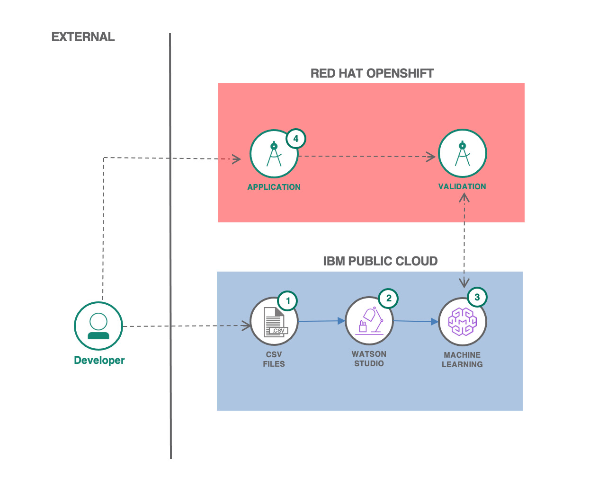

[](https://cloud.ibm.com) []()

# Maratona BTC 2020 | Desafio Final Red Hat

- [1. Sobre a Red Hat](#1-sobre-a-red-hat)
- [2. Visão geral do Desafio](#2-visão-geral-do-desafio)
    - [2.1. Introdução](#21-introdução)
    - [2.2. Objetivo](#22-objetivo)
- [3. Desenvolvimento](#3-desenvolvimento)
    - [3.1. Construção da pipeline de ML](#31-construção-da-pipeline-de-ml)
    - [3.2. Aplicação conteinerizada no OpenShift](#32-aplicação-conteinerizada-no-openshift)
- [4. Sobre a avaliação](#4-sobre-a-avaliação)
- [5. Suporte](#5-suporte)

<hr>

## 1. Sobre a Red Hat

A Red Hat Inc. começou quando um pequeno empresário conheceu um geek em uma conferência de tecnologia. Marc Ewing era o geek ocupado hackeando, debugando e distribuindo sua própria distribuição de Linux® em CDs de sua casa em Raleigh, Carolina do Norte.

A Red Hat continua a transformar o futuro da tecnologia com código aberto, unindo forças com a IBM. Em 2019, a IBM adquiriu a Red Hat por aproximadamente US$ 34 bilhões, quebrando o recorde de maior aquisição de software da história. Juntas, a IBM e a Red Hat continuarão a inovar com uma plataforma multicloud híbrida de última geração com o objetivo de redefinir o mercado de nuvem para os negócios. Enquanto a empresa olha para o futuro, a Red Hat ainda é a Red Hat e continua a manter os mesmos valores e princípios que orientam sua marca.

Em mais de 25 anos, a Red Hat cresceu de uma pequena empresa doméstica para a fornecedora líder mundial de soluções coorporativas de código aberto. A empresa foi muito além do Red Hat Enterprise Linux para virtualização, middleware, desenvolvimento de aplicativos, armazenamento, computação em nuvem e gerenciamento. Como sempre, tudo continua sendo feito de forma open-source.

A plataforma de contêineres OpenShift, construída com base no Kubernetes, é um dos produtos oferecidos pela Red Hat para o gerenciamento Enterprise de aplicações conteinerizadas, e você terá acesso a essa excelente ferramenta para ajudá-lo(a) a concluir o DESAFIO FINAL da Maratona Behind the Code 2020!

## 2. Visão Geral do Desafio

### 2.1. Introdução 

Há muito tempo as principais descobertas da astronomia eram feitas a olho nu. Hoje, a astronomia moderna é feita por ferramentas de alta tecnologia como um poderoso telescópio que amplifica pequenos pontos em uma galáxia muito distante, radiotelescópios que captam sinais de rádio do espaço profundo e mapeiam o universo observável, uma rede completa de telescópios observando o mesmo ponto e formando uma imagem do buraco negro, ou em um telescópio de órbita como o Hubble.

O aprendizado de máquina é uma tecnologia emergente que pode ajudar em muitas áreas da ciência, como a astronomia. Hoje, os Atrônomos têm uma grande quantidade de dados disponíveis de muitas fontes diferentes e com muitos tipos de propósitos diferentes. Um campo interessante da atronomia é a exploração de planetas, que consiste em encontrar novos planetas para mapear nossa vizinhança cósmica e obter uma melhor compreensão do universo.

Encontrar um novo planeta é uma tarefa difícil porque a tecnologia para encontrá-los só foi criada há algumas décadas e alguns deles nem conseguimos ver. Ainda há questões em aberto em termos de descoberta de um planeta sem vê-lo. Felizmente, cada nova descoberta possível foi catalogada, o que significa que há muitos dados disponíveis para projetar um modelo de classificação capaz de indicar se os dados são realmente um planeta, um falso positivo ou um possível candidato a planeta e requerem mais estudos e atenção.

Com todo esse novo mundo de possibilidades que a Inteligência Artificial pode trazer, o que você acha que Ptlomeu e Galileu diriam sobre o quão longe chegamos em ciência e tecnologia para olhar para os céus?

### 2.2. Objetivo

O objetivo do desafio é, em suma, projetar e implementar um modelo de classificação de corpos celestes como uma **pipeline de scoring do scikit-learn** no Watson Machine Learning Service (WML), e realizar a correção de bugs, teste e deployment de uma aplicação conteinerizada no OpenShift, capaz de realizar requisições HTTP para realizar a submissão de sua solução. A visão geral da arquitetura da solução construída é apresentada no diagrama abaixo:



## 3. Desenvolvimento

### 3.1. Construção da pipeline de ML

Para a construção da pipeline de Machine Learning é fornecido um <a href="../../data/dataset/dataset.csv">conjunto de dados</a> e um <a href="../../data/notebook/notebook.ipynb">Notebook Jupyter em Python</a>, com grande parte do código boilerplate para a comunicação com a mais nova versão do WML, lançada em Outubro de 2020. Você deverá instanciar o <a href="https://cloud.ibm.com/catalog/services/watson-studio">Watson Studio</a>, o  <a href="https://cloud.ibm.com/catalog/services/machine-learning">Watson Machine Learning</a> e o <a href="https://cloud.ibm.com/objectstorage/create">Cloud Object Storage</a>; criar um projeto em branco no Watson Studio e importar o dataset e o notebook dado; construir a pipeline de ML e realizar o deployment da mesma no WML seguindo as instruções contidas no notebook fornecido. São listados a seguir alguns pontos importantes em relação à Parte 1 do desafio:

- No notebook fornecido é dado parte do código em Python para a construção de uma pipeline compatível com WML baseada no scikit-learn 0.23.2.
- A pipeline deve obrigatoriamente ser armazenada no Watson Machine Learning. Qualquer um dos frameworks suportados oficialmente pelo WML serão aceitos como solução, desde que sua pipeline esteja completamente de acordo com o especificado neste documento.
- A pipeline deve obrigatoriamente aceitar como parâmetros de entrada **todas as colunas do dataset fornecido, exceto a coluna `TARGET`**.
- Não altere em hipótese alguma o nome das variáveis do dataset de entrada. Você pode criar novas variáveis durante os passos dentro de sua pipeline, mas as **variáveis de entrada devem ser exatamente as que foram definidas**.
- Você não poderá criar instâncias do Watson Studio e WML na conta fornecida para acesso ao cluster OpenShift, então prepare sua conta pessoal para criar os serviços.
- Para instanciar os serviços de ML (Watson Studio, COS e WML), você pode utilizar qualquer conta IBM Cloud de sua preferência, inclusive criar uma nova caso não tenha mais CUHs disponíveis na camada grátis desse mês.
- É permitido executar o notebook Jupyter fora do Watson Studio, entretanto a equipe técnica não dará suporte e **a implementação de uma pipeline compatível no WML continua sendo obrigatória**. 

Após o deployment de sua pipeline de ML, você pode passar para segunda etapa, a ser realizada no cluster OpenShift fornecido.

### 3.2. Aplicação conteinerizada no OpenShift

Na última semana foi enviado um tutorial "esquenta" para que você se familiarizasse com o ambiente do OpenShift. Esse tutorial é simples e rápido de ser realizado, e continua disponível em: https://github.com/MBTC-2020-TOP100/OPENSHIFT-TUTORIAL. Se você não concluiu o tutorial, é altamente recomendado que você o faça antes de continuar.

Com as credenciais e a URL de ponta da sua pipeline de ML encapsulada no Watson Machine Learning em mãos, você irá precisar agora realizar o deployment de uma aplicação capaz de realizar uma requisição HTTP do tipo **POST** para um serviço interno do OpenShift. Tal serviço está exposto através do seguinte endereço: 

<h4 style="color: blue">http://172.21.86.186:5000/submit</h4>

O header **Content-Type** da requisição HTTP deve ser do tipo **application/json**, e corpo da requisição deverá ser um JSON com a seguinte estrutura:
```
{
       email_addr: string,
       wml_url: string,
       iam_token: string,
       submit_confirmation: bool
}
```
- O parâmetro **email_addr** deve ser do tipo *string*, contendo o seu e-mail da IBM Cloud (o mesmo preenchido no formulário para o acesso ao cluster OpenShift);
- O parâmetro **wml_url** deve ser do tipo *string*, contendo o endereço de ponta da sua pipeline encapsulada no WML na Etapa 1 do Desafio;
- O parâmetro **iam_token** deve ser do tipo *string*, contendo um token de autenticação da IBM Cloud do tipo IAM. Para gerar esse token é necessária a realização de uma requisição prévia, cujos detalhes estão descritos na seguinte documentação: https://cloud.ibm.com/docs/account?topic=account-iamtoken_from_apikey;
- O parâmetro **submit_confirmation** deve ser um valor do tipo *bool* (true ou false). O valor "false" indica que você deseja realizar apenas um teste e saber se sua pipeline está válida e apta para ser gravada como solução final; o valor "true" indica que você deseja submeter sua solução para pontuação. **ATENÇÃO: VOCÊ PODE REALIZAR QUANTOS TESTES DESEJAR, ENTRETANTO VOCÊ PODE SUBMETER UMA SUBMISSÃO VÁLIDA APENAS UMA ÚNICA VEZ**.

Você deverá investigar o resultado das requisições realizadas por sua aplicação diretamente nos logs das Pods de seu Deployment no OpenShift. Lembre-se do tutorial e das funções manuais para re-inicializar suas Pods.

Para te ajudar no desenvolvimento da aplicação, são fornecidos alguns templates em diferentes linguagens de programação listados abaixo. Mas atenção, os templates contêm bugs inseridos propositalmente, e caso você opte por utilizá-los, deverá primeiro consertar os erros e em alguns casos inserir parte da lógica necessária que está faltando.

- A aplicação pode ser construída do zero, em qualquer linguagem de programação, mas a conteinerização e deployment no OpenShift fica completamente por sua conta.
- Participantes que criarem loops infinitos de requisições ao endpoint fornecido terão seus Deployments deletados automaticamente.

Links para o repositório dos templates de aplicações de submissão disponibilizados:

- [Clojure](https://github.com/MBTC-2020-TOP100/Clojure-Template)
- [Julia](https://github.com/MBTC-2020-TOP100/Julia-Template)
- [Rust](https://github.com/MBTC-2020-TOP100/Rust-Template)
- [Python](https://github.com/MBTC-2020-TOP100/Python-Template)
- [Node.js](https://github.com/MBTC-2020-TOP100/Node-Template)

Lembre-se de que cada template possui suas peculiaridades, com quantidades e tipos de bugs variados. Mesmo que você nunca tenha visto algumas das linguagens, as aplicações são simples o suficiente para que as sintaxes sejam rapidamente aprendidas (Google e Stackoverflow são seus aliados!). Dê atenção para as Dockerfiles fornecidas, que assim como os códigos, **não estão prontas** e precisam de ajustes na maioria dos casos.

## 4. Sobre a avaliação

A pontuação final no desafio será calculada totalmente com base no "**f_beta score**" do seu modelo de ML. O *f_beta score* é uma variante do *f_score*. O *f_beta_score* é calculado por meio de uma média harmônica baseada na **Precisão**, no **Recall** do modelo avaliado, e em um parâmetro beta. Para a pontuação dos modelos neste desafio o parâmetro beta é configurado em **1.5**. Se desejar, pode ler detalhes sobre o *f_beta score* no <a href="https://en.wikipedia.org/wiki/F-score">Wikipédia</a> ou na <a href="https://scikit-learn.org/stable/modules/generated/sklearn.metrics.fbeta_score.html">documentação do método no scikit-learn</a>. Resumindo, seu modelo deve possuir bom **Recall** além de boa **Precisão** para ser bem pontuado.

A construção da aplicação conteinerizada é apenas uma "barreira" para a submissão da sua solução, e não vale pontos no desafio - entretanto se você não completá-la, não conseguirá submeter sua solução para ser pontuada.

Os campeões serão os participantes que produzirem os melhores modelos de ML. O tempo de entrega do desafio será usado apenas como critério de desempate.

## 5. Suporte

A equipe Maratona estará prestando suporte em ambos os servidores do discord, então em caso de qualquer problema que você tenha com a plataforma ou os serviços, entre em contato conosco e tentaremos ajudá-lo. Procure **no canal público de dúvidas** pelo João Pedro (JP) ou pelo Vanderlei.

**Lembrando que não serão respondidas quaisquer tipos de questões sobre o desafio ou dúvidas sobre a plataforma e serviços que forem enviadas no privado para qualquer integrante da organização do evento.**

Abaixo você encontra link da documentação dos serviços, e alguns tutoriais de como realizar o deploy de outras bibliotecas no Watson Machine Learning que podem ser úteis, e como acessar o serviço pela API REST HTTP.

- [Documentação Watson Studio (Cloud Pak for Data as a Service)](https://dataplatform.cloud.ibm.com/docs/content/wsj/analyze-data/wml-ai.html)
- [Documentação do SDK Python do Watson Machine Learning](http://ibm-wml-api-pyclient.mybluemix.net)
- [Documentação da API REST do Watson Machine Learning](https://cloud.ibm.com/apidocs/machine-learning)
- [Tutoriais de Watson Machine Learning](https://dataplatform.cloud.ibm.com/docs/content/wsj/analyze-data/ml-samples-overview.html)
- [Docker Hub](https://hub.docker.com/)

Boa sorte!

<hr>

## Licença

Copyright 2020 Maratona Behind the Code

Licensed under the Apache License, Version 2.0 (the "License");
you may not use this file except in compliance with the License.
You may obtain a copy of the License at

       http://www.apache.org/licenses/LICENSE-2.0

Unless required by applicable law or agreed to in writing, software
distributed under the License is distributed on an "AS IS" BASIS,
WITHOUT WARRANTIES OR CONDITIONS OF ANY KIND, either express or implied.
See the License for the specific language governing permissions and
limitations under the License.
